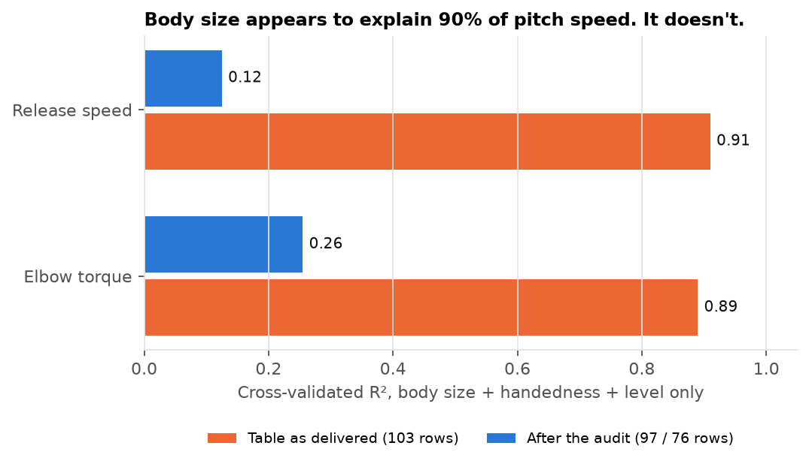
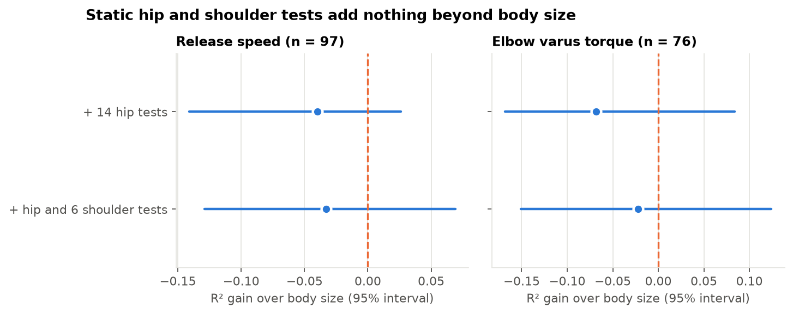
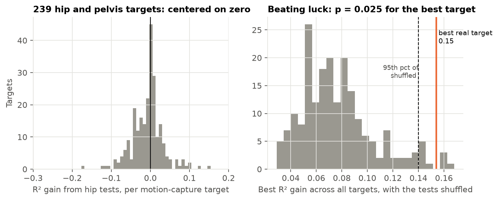

# Do static hip and shoulder tests predict how a pitcher throws?

[](https://github.com/Andresperez397/vald-hip-mobility-pitching/actions/workflows/ci.yml)


## At a glance

- **Question:** Do static hip and shoulder strength and mobility tests predict release speed, elbow load, or how the hips and pelvis move, once body size is accounted for?
- **Answer:** No. For 97 pitchers, 25 static tests added nothing to body size on pitchers the model had not seen, and only one of 239 hip and pelvis motion measurements cleared a shuffled-label test, narrowly.
- **Why it matters:** The lab's table had 6 corrupt and 21 placeholder-mass rows. Left in, body size seems to explain 91% of release speed; after the audit it explains 12%.
- **Start here:** [Two-page summary](reports/Hip%20Mobility%20and%20Pitching%20-%20Summary.pdf) · [the audit](DATA_AUDIT.md) · [the figure that shows the trap](reports/figures/fig1_audit.png)




**Data:** one row per pitcher, 103 professional pitchers (88 minor league, 15 major league) from the PLNU Pitching Lab: static VALD strength and range-of-motion tests, body size, and one session of fastballs captured with markerless motion capture. The data are private. This repository has the code, aggregate results and a synthetic stand-in that runs end to end.
**Stack:** Python (pandas, scikit-learn, NumPy), pytest, GitHub Actions.

## Findings

**1. The table as delivered is not analyzable, and the problem hides itself.**
- **6 corrupt rows:** release speeds of 36–41 mph, heights of 29–41 m, elbow torque near 0.1 Nm (unit or capture errors).
- **21 placeholder-mass rows:** body mass entered as 1 kg, with elbow torque on a different scale (25–47 Nm against 112–281 Nm for everyone else). That torque cannot be used.
- **The trap:** on the raw table, a model with only height, mass, handedness and level reaches a cross-validated R² of **0.91 for release speed and 0.89 for elbow torque**. It is just recognizing which rows are broken.

| Cross-validated R², body size + handedness + level | Raw table | After the audit |
|---|---|---|
| Release speed | 0.91 | **0.12** (n = 97) |
| Elbow varus torque | 0.89 | **0.26** (n = 76) |

**2. Static tests do not predict release speed or elbow torque beyond body size.**

| Model (10-fold CV × 20 repeats, held-out pitchers) | Release speed R² | Elbow torque R² |
|---|---|---|
| Guess the mean | 0 | 0 |
| Body size, handedness, level | 0.125 | 0.255 |
| + 14 hip tests | 0.085 | 0.187 |
| + hip and 6 shoulder tests | 0.092 | 0.233 |

- **Gain over body size:** −0.04 (95% CI −0.14 to +0.03) for release speed and −0.07 (−0.17 to +0.08) for elbow torque with the hip tests, and no better with shoulder tests added.
- **Elbow torque tracks body mass, not mobility:** 0.26 R² comes from size alone.
- **Only 76 of the 97 pitchers have a usable torque,** and 8 of the 14 shoulder tests are missing for more than half the pitchers, so they were left out.



**3. Static hip tests barely explain how the hips and pelvis move.**
- **Setup:** 239 hip, pelvis and hip-shoulder separation measurements at foot strike, release and other delivery events; 14 hip tests plus body size as predictors; compared with body size alone.
- **Typical target:** median gain −0.001 R². 46% of targets improved at all.
- **The best target** (pelvis rotation about the vertical-axis `y` at the moment of maximum knee lift) gains 0.15 R², against 0.14 as the 95th percentile of the best gain when the tests are shuffled across pitchers (200 shuffles, p = 0.025). It is the only one of 239 that clears that bar.
- **Honest reading:** one borderline result in 239 looks, which a single run can't separate from luck. It is a hypothesis for the next sample, not a finding.



## How the analysis was done

- **Audit first** ([DATA_AUDIT.md](DATA_AUDIT.md)): rules for corrupt rows, placeholder mass, mostly-missing tests and near-duplicate targets, applied before any model. Every rule's effect is counted in [reports/tables/data_audit.json](reports/tables/data_audit.json).
- **Plan** ([ANALYSIS_PLAN.md](ANALYSIS_PLAN.md)) and the one change made after seeing results ([DEVIATIONS.md](DEVIATIONS.md)). This is *not* pre-registered: it was written after exploratory reports on the same data (see below).
- **Honest validation:** one row per pitcher, so K-fold already holds out whole pitchers. Winsorizing, imputation, scaling and the ridge penalty are all fit on the training fold only. The best-of-239 result is judged against a permutation null of the *best* target, not against zero.
- **Tests (11)** on the synthetic stand-in, where the truth is known: every planted problem is found; the held-out outcome cannot change its own prediction; folds never share a pitcher; the winsorizer uses training data only; the uncleaned table inflates R² past 0.5; the permutation test recovers a planted hip target.

## Earlier exploratory reports

This project replaces eight exploratory R Markdown reports on the same data, which reported much higher R² values (for example, 0.85 for elbow torque from motion-capture variables). Those reports pooled the corrupt and placeholder rows. The 0.85 matches what the raw table gives for body size alone (0.89, with a similar RMSE of about 27 Nm): it reflects the broken rows, not hip mechanics. They are superseded by this repository.

## Limitations

- **Small, one-session sample:** 97 pitchers, one visit each. With 25 correlated tests the intervals on R² gains span about ±0.1, so small real effects cannot be ruled out.
- **Torque scale:** elbow torque comes from the capture system's inverse dynamics; its absolute scale was not independently validated, and only 76 pitchers have it.
- **Capture system:** all sessions are markerless. Differences between capture sessions are not modeled.
- **Left- versus right-handed pitchers** share one model, with a handedness indicator.

## Run it

```bash
python -m venv .venv && .venv/bin/pip install -r requirements.txt
.venv/bin/python scripts/make_synthetic.py            # synthetic stand-in, same structure and problems
.venv/bin/python scripts/01_data_audit.py --synthetic
.venv/bin/python scripts/02_run_analysis.py --synthetic
.venv/bin/python scripts/03_uncleaned_comparison.py --synthetic
.venv/bin/python -m pytest -q
```

With access to the private table: set `VALD_DATA=/path/to/master.csv` and drop `--synthetic`. The synthetic stand-in is random and carries no real athlete's values; its results are only a check that the pipeline finds what was planted.

## Data and license

- **Data:** private lab data from the PLNU Pitching Lab. Shared with permission as aggregate results and code only: no athlete names, IDs, session dates, file names or athlete-level values appear anywhere in this repository or its history.
- **Credit:** PLNU Pitching Lab and Tony Martin.
- **Code:** MIT (see `LICENSE`).
